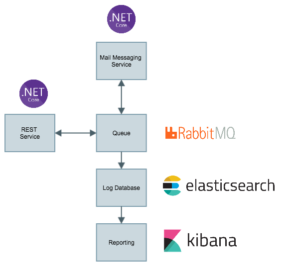

# Message Service

The Message Service is, as name says, a Service to manage submissions of messages of a bunch of kinds in a SOA/Microservices cenario.
It`s intended to be the gateway to send and track submissions of email, sms, push notifications and so on.

## Architecture

The Message Service solution is composed by a **Main Service**, that is a **ASP.Net Core WebAPI** for a RESTFull interface.
All messages sent are enqueued in **RabbitMQ** and consumed by a proper specialized service. The list of specialized servies is:

- Mail Service: To manage e-mail mailing

Logs are stored in **Elasticsearch** and can be explored througth **Kibana**. Every component of the solution has his own key and follow the pattern bellow.

`[soluction_name]-[app_name]-{0:yyyy.MM}`

## Setup

The Message Service soluction can be deployed in a bunch of ways, but is strongly recomended to use the `docker-compose` recipe to get the entire cluster up and running.

### Docker Compose

1. Install Docker;
2. Inside `src` folder, run the following command: `$ docker-compose up`
3. Done!

## Develop

Comming ...

## Feedback

Comming ...

## Contributing

Comming ...

## License

This project is licenced under terms of [MIT](LICENSE.txt) license.