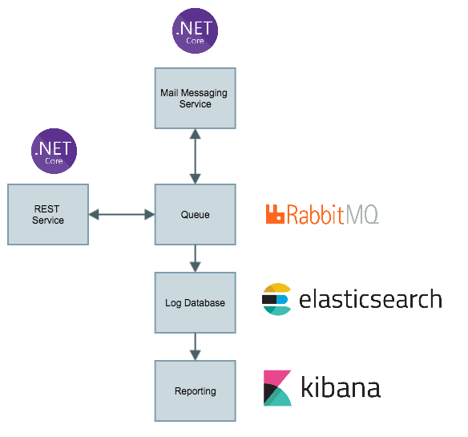

# Message Service

The Message Service is, as name says, a Service to manage submissions of messages of a bunch of kinds in a SOA/Microservices cenario.
It`s intended to be the gateway to send and track submissions of email, sms, push notifications and so on.

## Architecture

